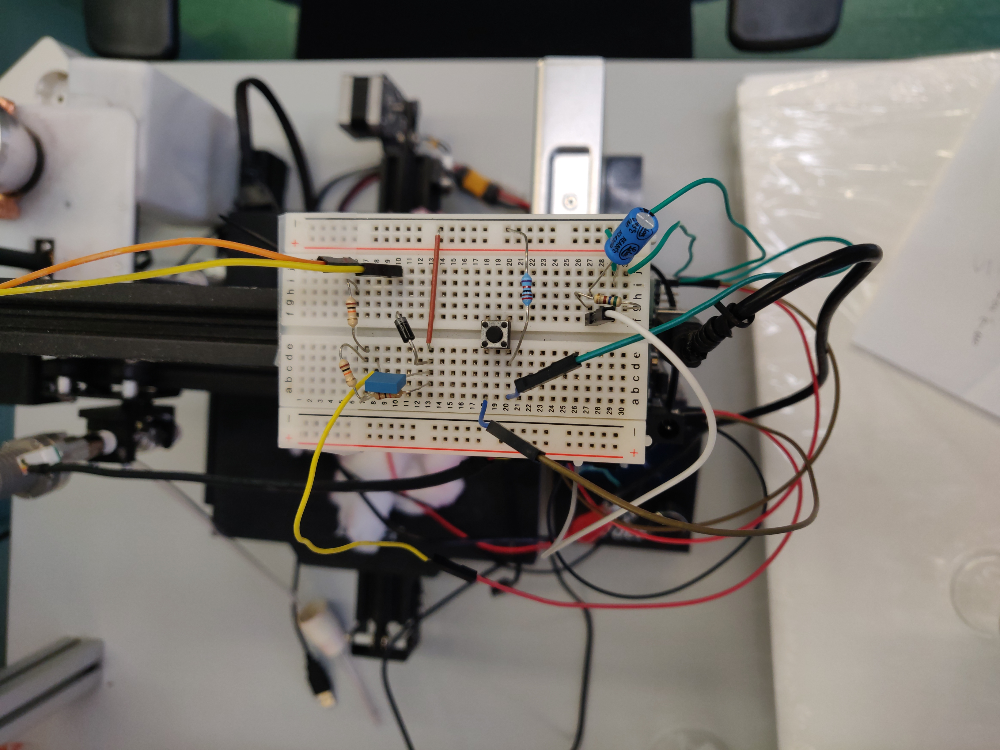
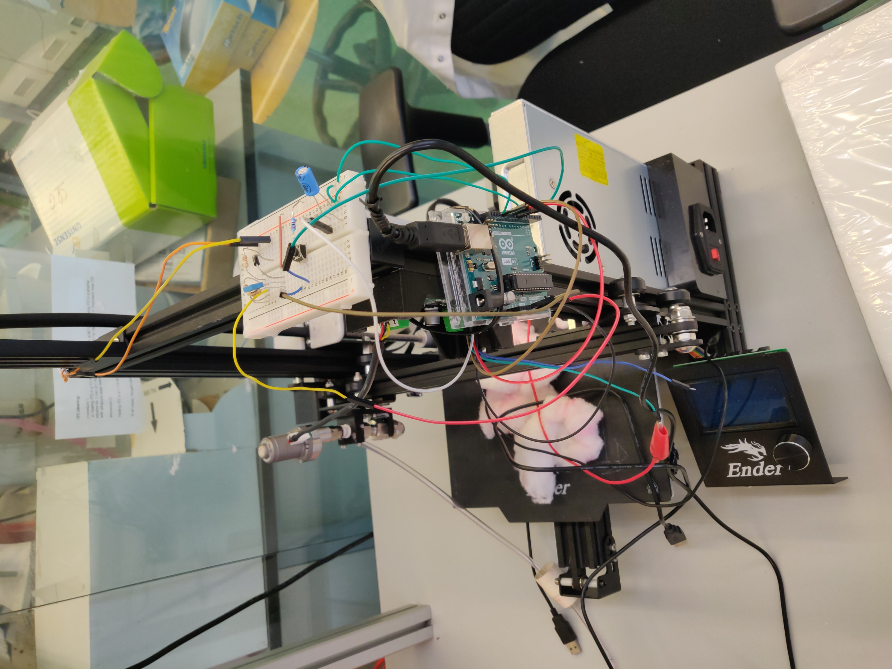

# automated-spray-from-3Dprinter
A *Creality3D Ender-3 Pro* 3D printer has been converted in order to spray mid-area surfaces (approx. up to 15x15 cm) with a focus on the coverage homogeneity and the possibility to spray fine-grained suspensions additionally to solutions.

This repository contains some code and some hardware description for allowing the reproduction.

[Here (3 min, 300 MB)](https://uz.sns.it/~ilario/VID_20210902_151558.mp4) you can find a video of the first prototype working.

## Comparison with other automated spray coaters

We found various benchtop automated spray coaters commercially available, for example from [MinderHightech](https://minder-hightech.en.made-in-china.com/product/MFWTIpzZrRVC/China-Small-Size-Hardware-Electronic-Plastic-Toy-Automatic-Spray-Painting-Machine.html), [IDS](https://www.idsnm.com/products/) or [Nadetech](https://nadetech.com/products/spray-coating).

The most important differences are:

* the focus of our system is on the homogeneity of the coverage, with the possibility to have very low loadings;
* our system is being designed for spraying also suspensions of fine-grained solid powders.

## Hardware modifications

### Extruder nozzle

The whole nozzle block has been removed and its connections unplugged from the motherboard.

The extruder temperature check can be disabled when printing (using G-Code [M302](https://marlinfw.org/docs/gcode/M302.html)). If this check is in place the printer will refuse to move the extruder unless an extruder temperature greater than 170 °C is detected.

For development purposes it is possible to trick the printer to measure a false extruder temperature, bypassing the mentioned check even when not printing (i.e. when moving the printer through its own physical interface). This can be achieved connecting a 1 kΩ resistor in place of the nozzle thermocouple, which results in the system read a false temperature aroud 173 °C.

### Extruder stepper motor

The extruder motor has also been removed.

A custom external circuit, described below, has been connected to the connector of the cable going from the motherboard to the removed extruder motor.

### Spray nozzle

A XXX nozzle from Bete Ltd. has been selected for outputting a fine mist spray. It has been installed in place of the extruder nozzle.

### Pump

A MGD1000P from TCS MicroPumps pump has been attached to the nozzle support. The pump is controlled by a small motherboard, which allows us to control the flow using a 0-5 V input which we can provide using an Arduino Uno (with some interface electronics, see below).

### Circuit interface for Arduino output

The Arduino Uno can output 0 V or 5 V but does not have a DAC (Digital-to-Analog Converter) so that it cannot output voltages between 0 and 5 V.
Other Arduino models can have a real analog output (they have a DAC) but they reach a maximum of 3.3 V.
The [analogWrite function](https://www.arduino.cc/reference/en/language/functions/analog-io/analogwrite/) on Arduino Uno works outputting a [Pulse Width Modulation](https://www.arduino.cc/en/Tutorial/Foundations/PWM) wave (PWM) quickly alternating 5 and 0 V for different durations. This results in an erratic flow with our pump. So, in order to output voltages in the 0-5 V range a potentiometer can be used for manual regulation or a [low-pass RC filter](https://en.wikipedia.org/wiki/Low-pass_filter#RC_filter) can be employed for flattening the PWM signal. We chose the latter option as it allows to set the flow from the Arduino code ensuring its reproducibility.

### Circuit interface for Arduino input

For convenience, we'll have the extruder motor connection cable communicating to the Arduino when the pump should be activated.

The extruder stepper motor receives pulses of +24 V, 0 V and -24 V. Arduino analog input can read 0-5 V. For converting the voltages into the acceptable range we used the following electrical scheme:

the result is a clean signal at 0 V for 0.45 s and at approx 1 V for 0.15 s.

Both the input and the output circuits are implemented on the same breadboard.

## Software

In order to get a constant ON state and a quick switch to the OFF state for the pump, the pulsed extruder stepper motor signal can be processed using an Arduino rather than an analogic circuit.

The code can be found in the `arduino-pulse_detector.ino` file.
