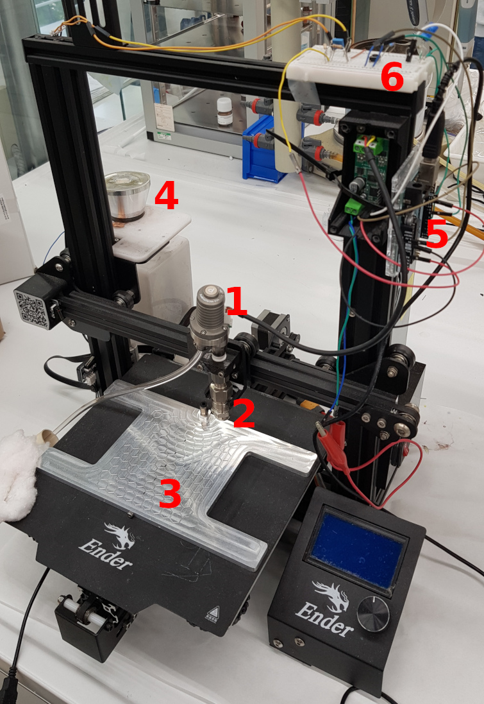
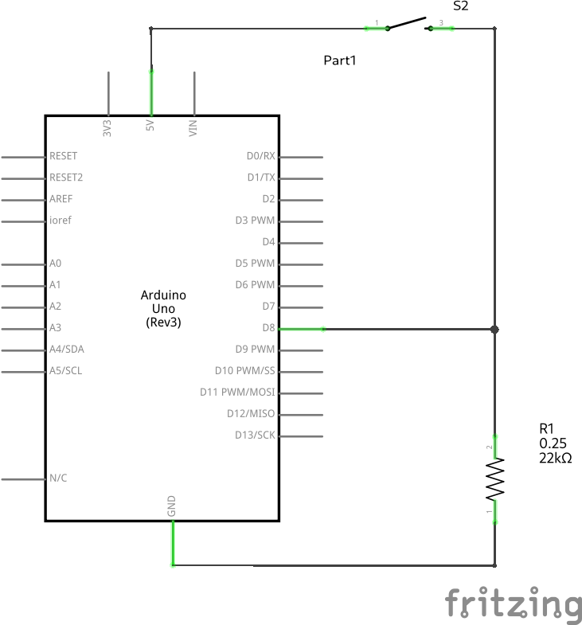
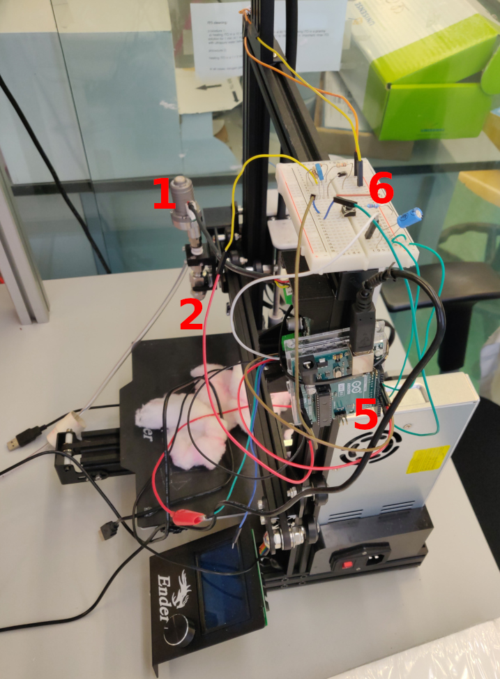

# automated-spray-from-3Dprinter
A *Creality3D Ender-3 Pro* 3D printer has been converted in order to spray **mid-area surfaces** (approx. up to 15x15 cm) with a focus on the coverage homogeneity and the possibility to spray fine-grained suspensions additionally to solutions.

This repository contains some code (GCODE for moving the printing head and Arduino code) and some hardware description for allowing the reproduction.

Our modifications included: the replacement of the extruder with a **nozzle** (BETE Ltd., full cone with an opening of 90° creating a fine mist); the replacement of the stepped motor feeder with a **pump** (TCS MicroPumps, model MGD1000P); the addition of a **custom aluminum vacuum hold down bed**; the addition of a commercial **ultrasonication system** for keeping the ink well suspended; the connection of a **resistor to the connection port originally in place for the thermocouple of the removed extruder**; the addition of an **Arduino Uno** board programmed for starting the spray when the 3D printer tries to start removed stepped motor; the **custom electronics** for interfacing the Arduino with the stepped motor controller and with the pump speed controller.

[Here (3 min, 300 MB)](https://uz.sns.it/~ilario/VID_20210902_151558.mp4) you can find a **VIDEO of the FIRST PROTOTYPE** working.

In the above printer, the visible modifications are: **1** commercial pump; **2** commercial nozzle; **3** custom made vacuum hold down bed; **4** commercial ultrasonicating system; **5** Arduino Uno board; **6** custom electronics.

## Comparison with other automated spray coaters

We found various benchtop automated spray coaters commercially available, for example from [MinderHightech](https://minder-hightech.en.made-in-china.com/product/MFWTIpzZrRVC/China-Small-Size-Hardware-Electronic-Plastic-Toy-Automatic-Spray-Painting-Machine.html), [IDS](https://www.idsnm.com/products/) or [Nadetech](https://nadetech.com/products/spray-coating).

The most important differences are:

* the focus of our system is on the homogeneity of the coverage, with the possibility to have very low loadings;
* our system is being designed for spraying also suspensions of fine-grained solid powders.

## Additions

Independently of the hardware of the printer, we added an ultrasonicator for trying to keep the suspensions suspended in the reservoir. This could be replaced by a magnetic stirrer in the future.

Also, we fabricated a vacuum hold down plate in aluminum. Being metallic, it can pass the heating from the underlying plate of the printer to the sample. The vacuum will help to hold the substrate in touch with the hot plate and also will help the drying removing the solvent crossing the substrate. Depending on the vacuum pump employed, a solvent trap could be needed for avoiding damaging the pump.

## Hardware modifications

### Extruder nozzle

The whole nozzle block has been removed and its connections unplugged from the motherboard.

The extruder temperature check can be disabled when printing (using G-Code [M302](https://marlinfw.org/docs/gcode/M302.html)). If this check is in place the printer will refuse to move the extruder unless an extruder temperature greater than 170 °C is detected.

For development purposes it is possible to trick the printer to measure a false extruder temperature, bypassing the mentioned check even when not printing (i.e. when moving the printer through its own physical interface). This can be achieved connecting a 1 kΩ resistor in place of the nozzle thermocouple, which results in the system read a false temperature aroud 173 °C.

### Extruder stepper motor

The extruder motor has also been removed.

A custom external circuit, described below, has been connected to the connector of the cable going from the motherboard to the removed extruder motor.

### Spray nozzle

A [BETE Ltd. HA-0.10 hollow cone nozzle](https://www.bete-europe.com/en/products/hollow-cone-nozzles/ha-hollow-cone-nozzle.html) with an orifice of 0.1 mm of diameter and emitting a cone of 90° has been selected for outputting a fine mist spray. It has been installed in place of the extruder nozzle.

### Pump

A MGD1000P from TCS MicroPumps pump has been attached to the nozzle support. The pump is controlled by a small motherboard, which allows us to control the flow using a 0-5 V input which we can provide using an Arduino Uno (with some interface electronics, see below).

### Circuit interface between Arduino output and pump

The Arduino Uno can output 0 V or 5 V but does not have a DAC (Digital-to-Analog Converter) so that it cannot output voltages between 0 and 5 V.
Other Arduino models can have a real analog output (they have a DAC) but they reach a maximum of 3.3 V.
The [analogWrite function](https://www.arduino.cc/reference/en/language/functions/analog-io/analogwrite/) on Arduino Uno works outputting a [Pulse Width Modulation](https://www.arduino.cc/en/Tutorial/Foundations/PWM) wave (PWM) quickly alternating 5 and 0 V for different durations. This results in an erratic flow with our pump. So, in order to output voltages in the 0-5 V range a potentiometer can be used for manual regulation or a [low-pass RC filter](https://en.wikipedia.org/wiki/Low-pass_filter#RC_filter) can be employed for flattening the PWM signal. We chose the latter option as it allows to set the flow from the Arduino code ensuring its reproducibility.

### Circuit interface from printer's stepper motor connector to Arduino input

For convenience, we'll have the extruder motor connection cable communicating to the Arduino when the pump should be activated.

The extruder stepper motor receives pulses of +24 V, 0 V and -24 V. Arduino analog input can read 0-5 V. For converting the voltages into the acceptable range we used the following electrical scheme:

the result is a clean signal at 0 V for 0.45 s and at approx 1 V for 0.15 s.

### Invert flow button

For the convenience of cleaning the nozzle with an inverted flow (sucking clean solvent dipping the nozzle in it) we added a button for inverting the flow of the pump. The electrical connection to the Arduino is represented in the following scheme:

All the three mentioned circuits are implemented on the same breadboard, as can be seen in the pictures.

## Software

In order to get a constant ON state and a quick switch to the OFF state for the pump, the pulsed extruder stepper motor signal can be processed using an Arduino rather than an analogic circuit.

The code can be found in the `arduino-pulse_detector.ino` file.
